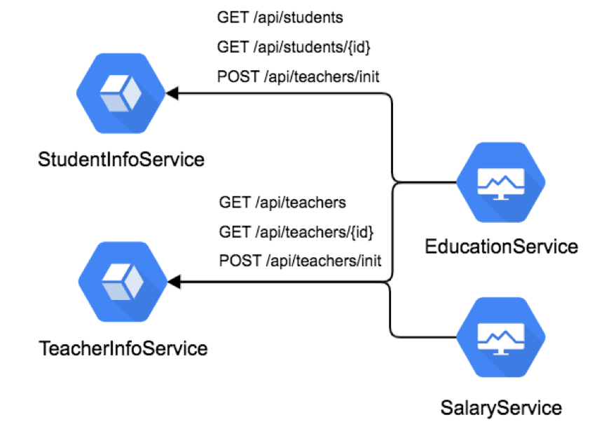

Contract Test with Pact
================

This simple client/server implementation demos how pact-python can be used for a contract test.

Further reading about pact is at https://docs.pact.io/ or https://docs.pact.io/blogs-videos-and-articles

## Microservice Examples


It has 4 components:
* `demo_services/teacher.py` -- a simple flask app that has 3 REST endpoints returns a JSON representation of teacher's information
* `demo_services/student.py` -- a simple flask app that has 3 REST endpoints returns a JSON representation of students' information
* `tests/test_education.py` -- a set of test cases using pytest and pact-python to test a simple
* `tests/test_salary.py` -- a set of test cases using pytest and pact-python to test a simple

contract between the client and server.
* `broker/` -- contains docker-compose files for a pact broker server

Set up your virtual environment with:

```
$ pip3 install pipenv
$ pipenv install
```

## Setup Pact Broker

you can try incorporating the pact broker in this process:

Start the broker server:
```
$ cd broker
$ docker-compose up
```
It's accessible at http://127.0.0.1 with username 'pactbroker' and password 'pactbroker'

## Creating / Validating Pacts for Consumer

#### Validate EducationService:
```
$ sh run_pact_test_education.sh
```
or
```
$ pytest ./tests/test_education.py
```
You'll see pact files are generated by this consumer test at `tests\educationservice-studentinfoservice.json` and `tests\educationservice-teacherinfoservice.json`

#### Validate SalaryService:
```
$ sh run_pact_test_salary.sh
```
or
```
$ pytest ./tests/test_salary.py
```
You'll see a pact file is generated by this consumer test at `tests\salaryservice-teacherinfoservice.json`

## Upload Pact to Pact-Broker

You can upload the pact files to pact-broker with version

```
$ sh upload_educationservice-studentinfoservice_pact.sh 0.0.1
```

```
$ sh upload_educationservice-teacherinfoservice_pact.sh 0.0.1
```

```
$ sh upload_salaryservice-teacherinfoservice_pact.sh 0.0.1
```

## Validating Pacts for Provider

Before you start to verify pact for provider, you have to fire up your server-side app

```
$ python3 ./demo_services/teacher.py
$ python3 ./demo_services/student.py
```

Then, use pact-verifier to verify the provider works as expected

* Get pact file from pact-broker and upload the result to pact-broker
```
$ pipenv run pact-verifier --provider-base-url=http://localhost:8001 \
  --pact-url="http://127.0.0.1/pacts/provider/TeacherInfoService/consumer/EducationService/latest" \
  --provider-states-setup-url=http://localhost:8001/api/teachers/init \
  --provider-app-version 0.0.0.1 \
  --pact-broker-username pactbroker \
  --pact-broker-password pactbroker \
  --publish-verification-results
```
or
```
$ sh verify_TeacherInfoService_EducationService.sh 0.0.0.1
```

* Get pact file from local file
```
$ pipenv run pact-verifier --provider-base-url=http://localhost:8001 \
  --pact-url=".\tests\educationservice-teacherinfoservice.json" \
  --provider-states-setup-url=http://localhost:8001/api/teachers/init \
  --provider-app-version 0.0.0.1
```